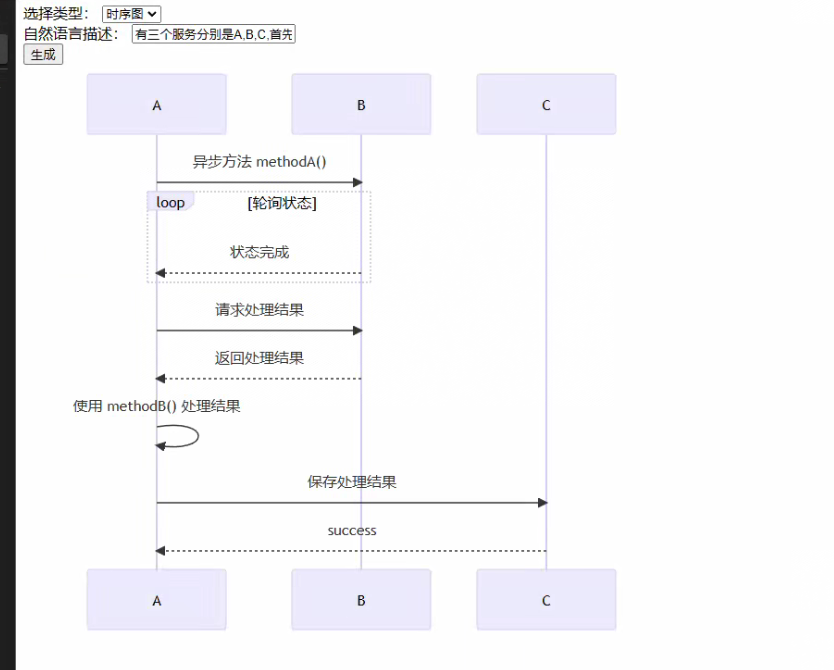

# DiagramGPT
v0.0.1

Generate various charts or diagrams using natural language with ChatGPT

利用 chatGPT 通过自然语言描述生成流程图，时序图等

> 目前只是一个可行性验证的DEMO，后续会不断完善并持续维护

# EXAMPLE
有三个服务分别是A,B,C,首先A使用methodA()方法异步地访问B，然后轮询B是否处理完成，B返回处理完成的状态；当B处理完时，A向B请求处理结果，B返回结果后A自身再对这个结果使用methodB处理，最后A访问C，将上面的处理结果保存到C，C返回success

